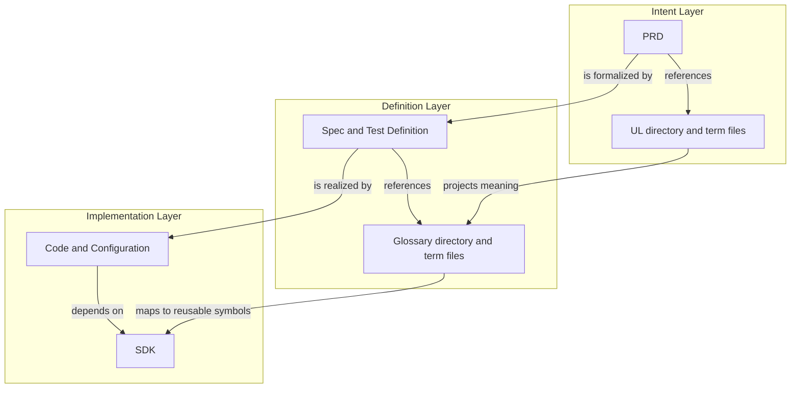

# Bodies and References Across Three Document Layers

Status: adopted

Scope: Docs Hygiene product model

## Position Statement

Docs Hygiene governs documents. To support both concrete statements and reusable
knowledge, repository documents are divided into Bodies and References and organized
into three layers: Intent, Definition, and Implementation.

Each layer contains two different artifact roles:

- a Reference supplies terms, types, or rules reused by many Bodies;
- a Body expresses the concrete intent, definition, or implementation of this project.

The distinction is simple: a Body says what this project is doing, while a Reference
stores shared meaning used in more than one place. Intent uses the UL as its Reference,
Definition uses the Glossary, and Implementation uses the SDK.

## Model

| Layer | Reference | Body | Primary question |
| --- | --- | --- | --- |
| Intent | UL directory (one term per Markdown file) | PRD | What should exist, and what does it mean? |
| Definition | Glossary directory (one term per Markdown file) | Spec and Test Definition | What precisely counts as correct? |
| Implementation | SDK | Code and Configuration | How is the definition realized? |

## Reference Axis

The Reference axis is `UL → Glossary → SDK`.

The UL is the Intent Reference directory. Each concept, relation,
action, state, invariant, outcome, or benefit has one Markdown file and a stable
identity. The directory manifest versions and enumerates those terms without
committing them to a particular technical representation.

The Glossary is the Definition Reference directory. Each Markdown
file projects a UL term into a precise specification identity such as a state name,
event name, enum value, schema term, or judgment vocabulary. The directory manifest
versions and enumerates those terms. A projection may narrow presentation for a
particular definition context, but it must not silently change the source meaning.

The SDK is the Implementation Reference. It realizes definition
identities as shared types, schemas, interfaces, modules, rules, or domain primitives
that concrete code and configuration can depend on.

The References across the three layers are related, not three independent sources of
meaning. Drift exists when a downstream reference can no longer be traced to
the upstream identity and semantic version it realizes.

## Subject Axis

The Body axis (Subject axis) is `PRD → Spec/Test Definition → Code/Configuration`.

A PRD Body makes concrete product claims through role, story, requirement, and
acceptance items. The items use standard Markdown links to UL term files, while
the PRD manifest pins the UL version.

A Spec Body or Test Definition makes that claim precise through model, constraint,
scenario, and verification items linking to Glossary term files.
It defines inputs, states, transitions, constraints, acceptance criteria, and
falsifiable outcomes. Its asset manifest pins the Glossary Library version. It says
what counts as correct without prescribing every implementation step.

Code and Configuration realize the definition using the SDK and other
implementation dependencies. They may be refactored or replaced while the
upstream intent and definition remain stable.

Subject traceability is broken when a PRD has no formal definition, a Spec has
no realization, or an implementation claim cannot be connected back to the
definition it is expected to satisfy.

## Governance Implications

Docs Hygiene governs two relationship families:

1. same-layer references: `PRD → UL`, `Spec/Test → Glossary`, and
   `Code/Configuration → SDK`;
2. cross-layer relationships: Bodies progress through
   `PRD → Spec/Test → Code/Configuration`, while References are refined through
   `UL → Glossary → SDK`.

These relationships expose different forms of cognitive debt:

- anonymous concepts or competing meanings in a subject;
- formal definitions that do not cover an intent invariant or benefit;
- reusable symbols whose semantics drift from the Glossary;
- specifications without implementations.

Governance must classify an artifact by responsibility and authority rather
than file extension. YAML can express intent policy, a definition schema,
or runtime configuration; its layer depends on what role it
plays.

## Boundaries

This position does not make Docs Hygiene an SDD planner. It does not require the
tool to generate PRDs, Specs, tasks, or code. It defines the relationships that
must remain inspectable while coding agents choose an adaptive execution plan.

The model is a product position, not a claim that all relationship checks are
implemented. Current capability remains documented by the CLI, configuration,
tests, and rule pages. New deterministic gates must enter a PRD and executable
tests before they are described as shipped.
