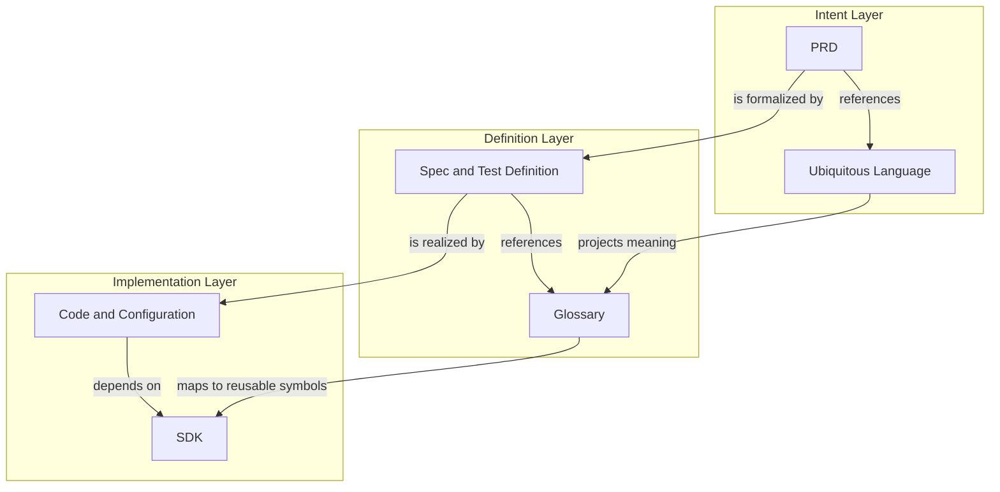

# Reference and Subject Across Three Layers

Status: adopted

Scope: Docs Hygiene product model

## Position Statement

AI-assisted development moves the scarce control point upstream from code
production to shared intent and verification. Docs Hygiene therefore treats a
repository as three related layers: Intent, Definition, and Implementation.

Each layer contains two different artifact roles:

- a Reference Library supplies reusable language or primitives shared by many Bodies;
- a Body expresses the concrete intent, definition, or realization under governance.

Library names a role rather than only a code package. The Intent Library is the UL,
the Definition Library is the Glossary, and the Implementation Library is the SDK
plus shared types, schemas, interfaces, and rules. The distinction between Library
and Body is reuse versus a specific governed assertion, not authority.

## Model

| Layer | Reference Library | Body | Primary question |
| --- | --- | --- | --- |
| Intent | Ubiquitous Language | PRD | What should exist, and what does it mean? |
| Definition | Glossary | Spec and Test Definition | What precisely counts as correct? |
| Implementation | SDK | Code and Configuration | How is the definition realized? |

## Reference Axis

The Reference axis is `UL → Glossary → SDK`.

The UL is the reusable Intent reference. It defines business and product
concepts, relations, actions, states, invariants, outcomes, and benefits without
committing them to a particular technical representation.

The Glossary is the reusable Definition reference. It projects UL meaning into
precise specification identities such as state names, event names, enum values,
schema terms, and judgment vocabulary. It may narrow presentation for a
particular definition context, but it must not silently change the source
meaning.

The SDK is the reusable Implementation Reference Library. It realizes definition
identities as shared types, schemas, interfaces, modules, rules, or domain primitives
that concrete code and configuration can depend on.

The three references are related projections, not three independent sources of
meaning. Drift exists when a downstream reference can no longer be traced to
the upstream identity and semantic version it realizes.

## Subject Axis

The Body axis (Subject axis) is `PRD → Spec/Test Definition → Code/Configuration`.

A PRD makes a concrete product claim using the UL: a user needs a benefit, an
action should be possible, or an invariant must hold.

A Spec or Test Definition formalizes that claim using the Glossary. It defines
inputs, states, transitions, constraints, acceptance criteria, and falsifiable
outcomes. It says what counts as correct without prescribing every
implementation step.

Code and Configuration realize the definition using Libraries and other
implementation dependencies. They may be refactored or replaced while the
upstream intent and definition remain stable.

Subject traceability is broken when a PRD has no formal definition, a Spec has
no realization, or an implementation claim cannot be connected back to the
definition it is expected to satisfy.

## Evidence Plane

Testing must be separated into definition and evidence:

- a test case, model, oracle, or verifier belongs to the Definition layer;
- a test result, acceptance record, runtime observation, or metric value belongs
  to the Evidence plane.

Evidence crosses all three layers. It shows whether Implementation satisfies
Definition and whether the resulting behavior delivers the benefit claimed by
Intent. Writing a test does not prove that it passed; producing a metric does
not prove that the metric still represents the intended user value.

## Governance Implications

Docs Hygiene should eventually be able to govern three relationship families:

1. same-layer references: `PRD → UL`, `Spec/Test → Glossary`, and
   `Code/Configuration → SDK`;
2. subject traceability: `PRD → Spec/Test → Code/Configuration → Evidence`;
3. reference projection: `UL → Glossary → SDK`.

These relationships expose different forms of cognitive debt:

- anonymous concepts or competing meanings in a subject;
- formal definitions that do not cover an intent invariant or benefit;
- reusable symbols whose semantics drift from the Glossary;
- implementation claims without validation evidence;
- evidence that proves technical behavior but not the intended user outcome.

Governance must classify an artifact by responsibility and authority rather
than file extension. YAML can express intent policy, a definition schema,
runtime configuration, or generated evidence; its layer depends on what role it
plays.

## Boundaries

This position does not make Docs Hygiene an SDD planner. It does not require the
tool to generate PRDs, Specs, tasks, or code. It defines the relationships that
must remain inspectable while coding agents choose an adaptive execution plan.

The model is a product position, not a claim that all relationship checks are
implemented. Current capability remains documented by the CLI, configuration,
tests, and rule pages. New deterministic gates must enter a PRD and executable
acceptance evidence before they are described as shipped.
