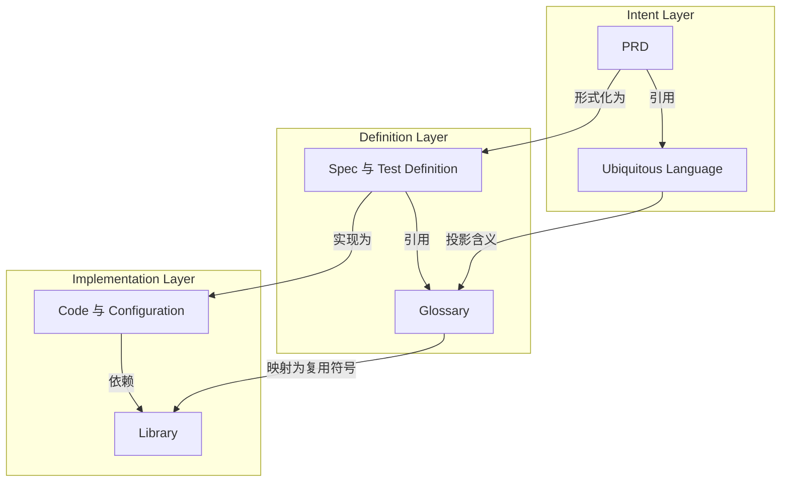

# 三个层次中的 Reference 与主体

状态：working

范围：Docs Hygiene 产品模型

## 立场主张

AI 辅助研发正在把稀缺控制点从代码生产推向共享意图和验证。Docs Hygiene 因此把
仓库理解为三个相互关联的层次：Intent、Definition 和 Implementation。

每个层次都包含两种不同的资产角色：

- Reference 提供被多个主体复用的语言或原语；
- 主体表达当前接受治理的具体意图、定义或实现。

Reference 不表示次要，主体也不表示更加权威。二者的区别是共享复用与具体受管主张。

## 模型

| 层次 | Reference | 主体 | 核心问题 |
| --- | --- | --- | --- |
| Intent | Ubiquitous Language | PRD | 应该存在什么，它意味着什么？ |
| Definition | Glossary | Spec 与 Test Definition | 怎样才精确地算正确？ |
| Implementation | Library | Code 与 Configuration | 定义如何被实现？ |

## Reference 轴

Reference 轴是 `UL → Glossary → Library`。

UL 是可复用的 Intent Reference。它定义业务和产品概念、关系、动作、状态、不变量、
结果与收益，但不把这些含义绑定到某一种技术表示。

Glossary 是可复用的 Definition Reference。它把 UL 含义投影为状态名、事件名、枚举
值、Schema 术语和判断词汇等精确规格身份。它可以针对特定定义语境收窄表达，但
不能静默改变来源含义。

Library 是可复用的 Implementation Reference。它把定义身份实现为共享类型、Schema、
接口、模块、规则或领域原语，供具体代码和配置依赖。

三类 Reference 是相互关联的投影，不是三个独立含义来源。当下游 Reference 无法
追溯到它所实现的上游身份和语义版本时，就产生了漂移。

## 主体轴

主体轴是 `PRD → Spec/Test Definition → Code/Configuration`。

PRD 使用 UL 提出具体产品主张：用户需要某种收益、某项动作应当成立，或者某条
不变量不能被破坏。

Spec 或 Test Definition 使用 Glossary 形式化该主张。它定义输入、状态、迁移、约束、
验收标准和可证伪结果，说明怎样才算正确，但不规定每一个实现步骤。

Code 与 Configuration 使用 Library 和其他实现依赖兑现定义。只要上游意图和定义
保持成立，它们可以被重构或替换。

当 PRD 没有形式定义、Spec 没有实现，或实现主张无法回到它应满足的定义时，主体
追溯关系就已经断裂。

## Evidence 平面

Testing 必须拆分为定义与证据：

- Test Case、模型、Oracle 或 Verifier 属于 Definition Layer；
- Test Result、验收记录、运行观察或指标值属于 Evidence 平面。

Evidence 跨越三个层次。它证明 Implementation 是否满足 Definition，以及最终行为
是否兑现 Intent 主张的收益。写了测试不等于测试通过；产生了指标也不等于指标仍然
代表预期用户价值。

## 治理含义

Docs Hygiene 最终应能治理三类关系：

1. 同层引用：`PRD → UL`、`Spec/Test → Glossary`、
   `Code/Configuration → Library`；
2. 主体追溯：`PRD → Spec/Test → Code/Configuration → Evidence`；
3. Reference 投影：`UL → Glossary → Library`。

这些关系暴露不同形态的认知债：

- 主体中出现匿名概念或竞争性含义；
- 形式定义没有覆盖意图中的不变量或收益；
- 可复用符号的语义偏离 Glossary；
- 实现主张没有验证证据；
- 证据证明了技术行为，却没有证明预期用户收益。

治理必须按职责和权威分类资产，不能按文件扩展名机械分类。YAML 既可能表达意图
策略、定义 Schema、运行配置，也可能是生成证据；它属于哪一层取决于实际角色。

## 边界

这个立场不会把 Docs Hygiene 变成 SDD 计划工具。它不要求生成 PRD、Spec、任务或
代码，而是定义 Coding Agent 自适应选择执行计划时仍需保持可检查的关系。

这张模型是产品立场，不代表所有关系检查已经实现。当前能力仍以 CLI、配置、测试
和规则页面为准。新的确定性门禁必须先进入 PRD 和可执行验收证据，才能被描述为
已经交付。
