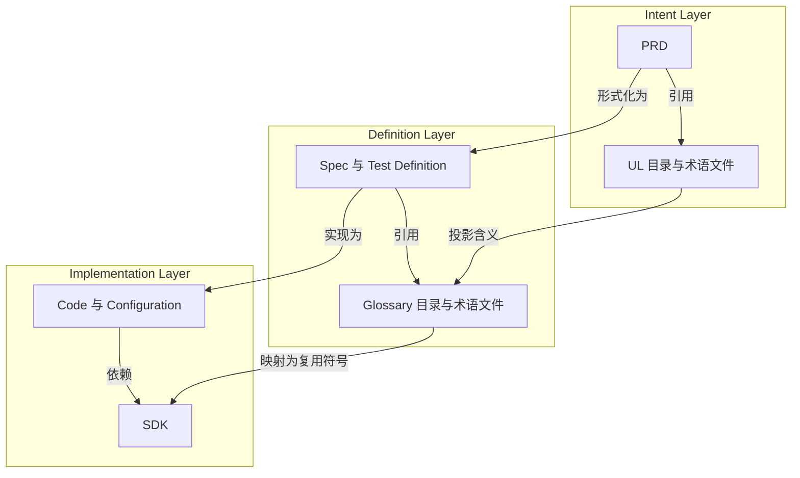

# 三层文档中的主体与引用

状态：adopted

范围：Docs Hygiene 产品模型

## 立场主张

Docs Hygiene 治理的对象是文档。为了让文档既能表达具体事项，又能复用已有知识，
仓库中的文档分为主体和引用，并按意图、规格、实现三个层次组织。

每个层次都包含两种不同的资产角色：

- 引用（Reference）提供可被多个主体复用的术语、类型或规则；
- 主体（Body）表达当前项目具体的意图、规格或实现。

两类角色的区别很简单：主体说明“这次要做什么”，引用保存“多处都会用到的共同
含义”。意图层的引用是 UL，规格层的引用是 Glossary，实现层的引用是 SDK。

## 模型

| 层次 | 引用 | 主体 | 核心问题 |
| --- | --- | --- | --- |
| 意图 | UL 目录（每个术语一个 Markdown） | PRD | 为什么做、为谁做、期望什么结果？ |
| 规格 | Glossary 目录（每个术语一个 Markdown） | Spec 与测试定义 | 怎样才精确地算正确？ |
| 实现 | SDK | 代码与配置 | 规格如何被实现？ |

## 引用轴

引用轴是 `UL → Glossary → SDK`。

UL 是意图层的引用目录。每个业务和产品概念、关系、动作、状态、
不变量、结果与收益拥有一个 Markdown 文件和稳定身份；目录 Manifest 为成员集定版，
但不把这些含义绑定到某一种技术表示。

Glossary 是规格层的引用目录。每个 Markdown 文件把一个 UL
术语投影为状态名、事件名、枚举值、Schema 术语或判断词汇等精确规格身份；目录
Manifest 为成员集定版。投影可以针对定义语境收窄表达，但不能静默改变来源含义。

SDK 是实现层的引用。它把定义身份实现为共享类型、
Schema、接口、模块、规则或领域原语，供具体代码和配置依赖。

三层引用相互关联，不是三个独立的含义来源。当下游引用无法
追溯到它所实现的上游身份和语义版本时，就产生了漂移。

## 主体轴

主体轴是 `PRD → Spec/测试定义 → 代码/配置`。

PRD 主体通过角色、故事、需求和验收条目提出具体产品主张。条目使用标准 Markdown
链接指向 UL 术语文件，PRD 的 Manifest 同时固定 UL 版本。

Spec 主体或测试定义通过模型、约束、场景和验证条目精确定义该主张，并链接到
Glossary 术语文件。它说明怎样才算正确，但不规定每一个实现步骤。

代码与配置使用 SDK 和其他依赖实现规格。只要上游意图和规格
保持成立，它们可以被重构或替换。

当 PRD 没有形式定义、Spec 没有实现，或实现主张无法回到它应满足的定义时，主体
追溯关系就已经断裂。

## 治理含义

Docs Hygiene 治理两类关系：

1. 同层引用：`PRD → UL`、`Spec/Test → Glossary`、
   `Code/Configuration → SDK`；
2. 跨层关系：主体沿 `PRD → Spec/Test → Code/Configuration` 逐层落实，引用沿
   `UL → Glossary → SDK` 逐层细化。

这些关系暴露不同形态的认知债：

- 主体中出现匿名概念或竞争性含义；
- 形式定义没有覆盖意图中的不变量或收益；
- 可复用符号的语义偏离 Glossary；
- 规格没有对应实现。

治理必须按职责和权威分类资产，不能按文件扩展名机械分类。YAML 既可能表达意图
策略、定义 Schema 或运行配置；它属于哪一层取决于实际角色。

## 边界

这个立场不会把 Docs Hygiene 变成 SDD 计划工具。它不要求生成 PRD、Spec、任务或
代码，而是定义 Coding Agent 自适应选择执行计划时仍需保持可检查的关系。

这张模型是产品立场，不代表所有关系检查已经实现。当前能力仍以 CLI、配置、测试
和规则页面为准。新的确定性门禁必须先进入 PRD 和测试，才能被描述为已经交付。
